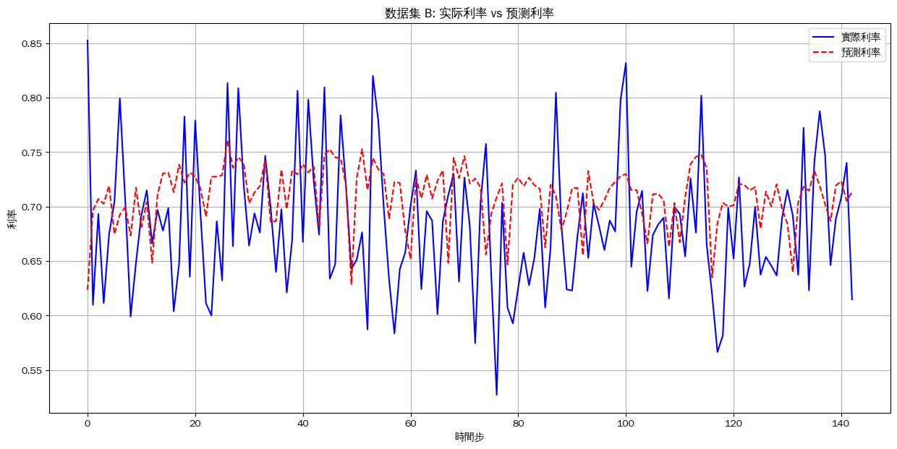
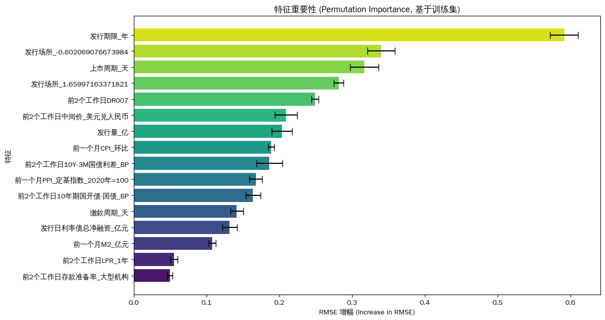
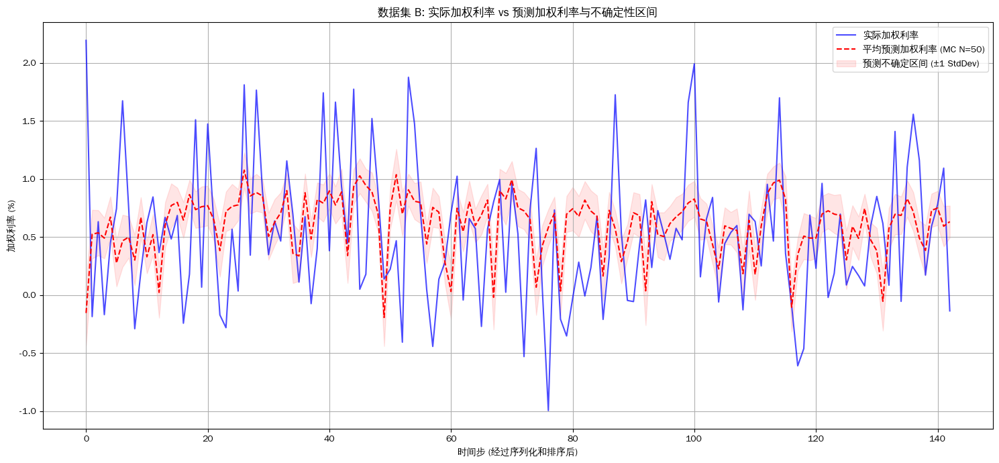

# cnogb-bond-signal-anomaly

Bond forecasting and anomaly detection using Transformer models with weighted feature extraction.

---

## Overview

A bond interest rate forecasting demonstration built with Transformer Encoder and PyTorch, featuring evaluation metrics including R² and RMSE, plus permutation importance analysis.

---

## Category / Lifecycle / Tags

- **Category**: Research
- **Type**: Transformer | Forecasting | Anomaly
- **Lifecycle**: stable
- **Tags**: transformer, forecasting, anomaly, finance

---

## Structure

```
Research/cnogb-bond-signal-anomaly/
├── img/                    # Result visualizations
├── notebooks/              # Jupyter notebooks
└── README.md               # This file
```

---

## How to Run

1. Install dependencies:
   ```bash
   pip install torch numpy pandas scikit-learn matplotlib
   ```

2. Run the Jupyter notebooks to execute the forecasting model

3. View results in the `img/` directory

---

## Dependencies

- PyTorch
- NumPy
- Pandas
- Scikit-learn
- Matplotlib

---

## Outputs / Demos

### Model Results

#### Data with Predictions


#### Feature Importance


#### MC Dropout Uncertainty


#### Residuals Distribution


#### Residuals vs Predicted


---

## Notes / Limitations

- This is a research demonstration project
- Focuses on bond interest rate forecasting using Transformer architecture
- Includes uncertainty quantification via MC Dropout

---

## Related Links

- [Project Catalog](../../catalog/index.md)
- [Repository Root](../../README.md)
